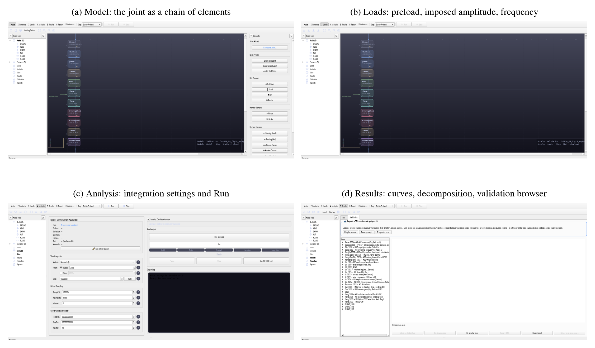

# Bolt Analysis Studio (BAS)

Energy-based lumped-parameter model of bolted-joint self-loosening, validated
against 205 preload curves digitised from 27 independent published studies.

The joint is a lumped assembly whose slow state (preload, embedding, creep, wear,
nut rotation and a surface-damage variable) is integrated cycle by cycle. Four
loss mechanisms act in parallel; the preload feeds back into the friction
capacity that sets slip and resisting torque, and runaway loosening and
self-arrest both emerge from that feedback. Every number in the companion paper and in the software annex is
recomputed from this repository. The paper itself is not part of it: what
is published here is the software, the corpus, the configurations and the
results it is built on.

**Authors.** Prof. Leonardo Rosa Ribeiro da Silva, PhD (leorrs@ufu.br),
Faculdade de Engenharia Mecânica, Universidade Federal de Uberlândia, Brazil,
and Neilon de Souza da Silva, PhD (neilon@petrobras.com.br), Petróleo
Brasileiro S.A. (Petrobras), Brazil. Authors of the software: the model, the implementation, the digitisation
of the validation corpus, the testing and the validation. It was written as a free tool for the self-loosening
analyses of the group at UFU and is released openly so that the same analyses
can be run, checked and extended by others.



## Repository layout

| Path | Content |
|---|---|
| `src/bolt_analysis_studio/numerical/dynamic_stiffness_analyzer.py` | The engine: slow-state integration, mechanisms, energy budget |
| `src/bolt_analysis_studio/validation/` | Case registry (inputs read from the papers), runner, canonical store, HTML reports |
| `src/bolt_analysis_studio/calibration/` | Knowledge base (adopted configurations, priors, provenance readers), shared calibrator |
| `src/bolt_analysis_studio/gui/` | PyQt6 application (V1 tabs and the V2 module chrome) |
| `Models/CALIBRATION_AND_VALIDATION/curve_library/` | Digitised reference curves (CSV), apparatus notes per study, digitisation manifests |
| `Models/CALIBRATION_AND_VALIDATION/validation_store.json` | Canonical results for the 210 registered curves, stamped with the configuration fingerprint |
| `New_Theory/adopted_configs.json` | Per-rig configurations with a provenance text for every constant |
| `New_Theory/build_annex_docx.py` | Generator of the software annex (Word), every number recomputed from the store |
| `New_Theory/robustness_checks.py`, `ablation_run.py`, `frozen_config_holdout.py` | Robustness study: criterion sweep, temporal hold-out, ablation |
| `New_Theory/ablation/`, `New_Theory/holdout/` | Stamped result files of the robustness study |
| `New_Theory/variable_explorer/` | Interactive documentation of every model field and every study (HTML) |
| `docs/superpowers/specs/` | Pre-registration documents (gates written before measuring) |
| `tests/` | pytest suite |

Most working records under `New_Theory/` and `docs/` are the development log of the
project and are written in Portuguese; the code, the paper generators and this
README are in English.

## Installation

Python 3.12 is the tested interpreter.

```bash
pip install -r requirements.txt        # numpy, scipy, matplotlib, PyQt6
pip install python-docx latex2mathml mathml2omml pytest   # document generators and tests
```

Windows 10 is the development platform; the code is pure Python and the tests run
headless (`QT_QPA_PLATFORM=offscreen` is set by `tests/conftest.py`).

## Quick start

```bash
python run_app.py --v2      # GUI: Model -> Contacts -> Loads -> Analysis -> Results -> Report
python run_app.py           # legacy seven-tab interface
python -m pytest tests/ -q  # full suite, about 16 min
```

## How a simulation runs

1. **Case registry** (`validation/case_registry.py`): one record per digitised
   curve with the inputs read from the paper (bolt, preload, amplitude or load,
   frequency, roughness, friction, member geometry) and the path of its CSV.
2. **Adopted configuration** (`New_Theory/adopted_configs.json`): the constants
   and forms of the rig that produced the curve, each with a provenance text;
   the runner merges shared constants, the pack of modes, the rig configuration
   and any per-curve entry into one `JointMaterial`.
3. **Engine** (`DynamicStiffnessAnalyzer.step_cycle`): once per load cycle the
   transverse slip is resolved from the friction capacity, each mechanism
   returns its preload increment and dissipated energy, the slow state is
   updated and the energy budget is closed.
4. **Result** (`CaseResult`): the model is aligned to the first data point,
   scored on the digitised abscissae (MAE, maximum residual, residual standard
   deviation) and written to the store with the configuration fingerprint.
5. **Documents**: the reports and the software annex are generated from the store;
   nothing is typed by hand.

## Reproducing the results

```bash
# 1. re-simulate the corpus into the canonical store (about 30 min, 6 workers)
python New_Theory/parallel_batch.py --workers 6 --store
# 2. per-curve and master HTML reports
PYTHONPATH=src python -m bolt_analysis_studio.validation.report
# 3. software annex (Word), every number recomputed from the store
python New_Theory/build_annex_docx.py
# 4. robustness study (Section 4.10 of the paper)
python New_Theory/ablation_run.py --workers 6                 # ~30 min per variant
python New_Theory/frozen_config_holdout.py --freeze 2026-07-14
python New_Theory/robustness_checks.py
```

## Data provenance

The reference curves were digitised from figures and tables of the cited
studies; none of the experimental data were measured for this work. Each
study has an apparatus note (`apparatus_notes/*.md`) and a digitisation manifest.
The CSVs are provided to make the comparison reproducible; the underlying data
remain the property of their original authors and publishers: the terms are
in `DATA_LICENSE.md`.

This public repository is a single-commit snapshot of the development repository
(`SNAPSHOT.md` gives the source commit). The dated artefacts that the temporal
analyses of the paper rely on are included as JSON under `New_Theory/holdout/`
and `New_Theory/ablation/`. The manuscript itself is not part of this repository.

## Licence and citation

Code under the MIT licence (`LICENSE`); the digitised reference data are not
covered by it (`DATA_LICENSE.md`). Please cite the software with the
metadata in `CITATION.cff` and the companion paper once published.

## Use of AI assistance

Claude Code with the Claude Opus 5 model (Anthropic) was used during development
as a coding assistant: to debug and refactor code, write tests, generate
documentation, and draft and translate text that the authors then reviewed. The
authors are not native speakers of English, so the tool also provided language
support for the documentation and the accompanying text. The physical model, every calibration decision, the
acceptance criteria, the data and the conclusions are the authors' own and were
verified by the authors, who take full responsibility for the content.
