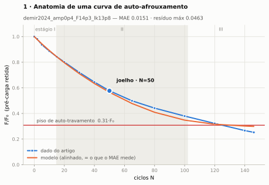
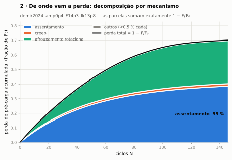
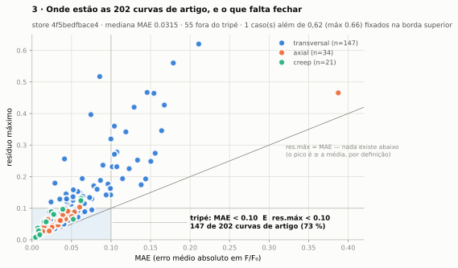
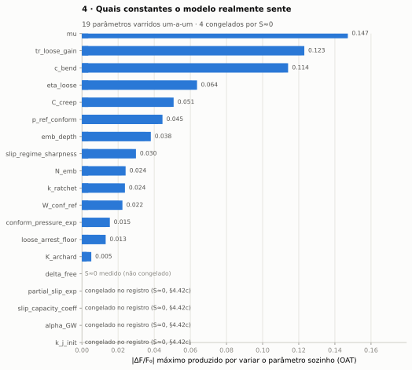
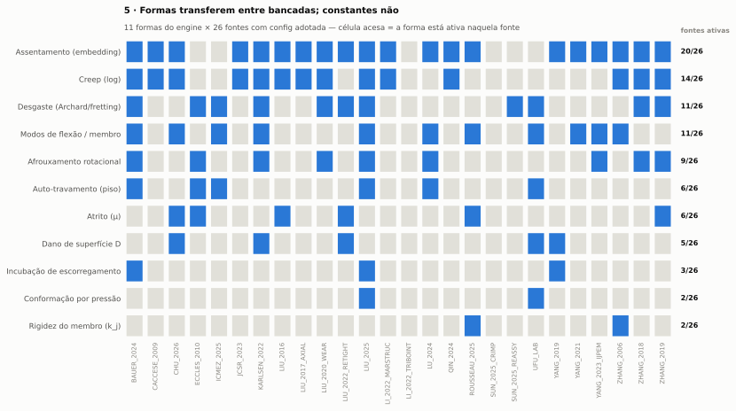

# Volume 2 — Explicar o modelo

> **O que este volume é.** Material para **terceiros**: aula, defesa, seção de
> paper, revisor cético. Três níveis de narrativa (1 parágrafo → 10 minutos →
> seminário), as cinco figuras-chave com o que cada uma prova, e um FAQ de
> objeções em que **cada resposta traz evidência citável**.
>
> Todo número aqui sai do store canônico `4f5bedfbace4`
> ([`figs/numbers.json`](figs/numbers.json)); as figuras são geradas por
> [`scripts/manual_figs.py`](../../scripts/manual_figs.py) e o gate `--check`
> prova que os arquivos no disco são o que aquele script + aquele store produzem.

---

## Nível 1 — o parágrafo (elevator)

> O auto-afrouxamento de juntas aparafusadas é tratado na literatura por
> correlações empíricas, ajustadas curva por curva. O BAS V2 faz outra coisa: é um
> modelo massa-mola-amortecedor com um **vetor de estado lento**
> `s = (F_0, δ_emb, δ_creep, δ_wear, θ_loose, D)`, matriz de rigidez reavaliada a
> cada ciclo, e quatro mecanismos de perda em paralelo com leis nomeadas de
> literatura (Norton, log-t, Archard, Greenwood-Williamson) acopladas pela hélice
> do parafuso. Com **três constantes fitadas no conjunto inteiro**, ele reproduz
> **147 de 202 curvas digitalizadas de 28 artigos** dentro de uma meta dupla e
> exigente — erro médio **e** erro de pico abaixo de 0,1 em F/F₀ — com mediana
> **0,0315**. O que ele fecha e o que ele não fecha estão declarados no mesmo
> lugar, com o fingerprint do motor contra o qual foram medidos.

**Se só houver tempo para uma frase:** *o que transfere entre bancadas são as
formas; as constantes são por par tribológico — e o modelo é construído para
tornar essa distinção verificável.*

---

## Nível 2 — os 10 minutos (com as cinco figuras)

Ordem sugerida de apresentação. Cada figura existe em variante clara e escura
(`-dark.svg`) e traz, no `numbers.json`, os campos `variaveis`, `como_ler` e —
onde couber — `ressalva`.

### Figura 1 — anatomia de uma curva de auto-afrouxamento

**Variáveis.** Eixo x = ciclos N; eixo y = F/F₀, a fração da pré-carga inicial
ainda retida. Azul = dado digitalizado do artigo; laranja = modelo, já dividido
pelo divisor de alinhamento (**é a curva que o MAE mede**). Faixa cinza = Estágio
II; I/II/III são as janelas 0–10 %, 10–70 % e 70–100 % dos ciclos.

**Como ler.** Procure três coisas: o **patamar** inicial (Estágio I,
assentamento), o **joelho** onde a queda acelera (marcado onde metade da perda
total já ocorreu) e o **piso** onde a curva estabiliza — no modelo esse piso é a
comporta de auto-travamento, **não** um ajuste. A distância vertical entre as
curvas em cada N é o resíduo.

**Leitura do dado exibido** (`demir2024_amp0p4_F14p3_lk13p8`): MAE **0,0151**,
resíduo máximo **0,0463**; joelho em **N=50** com r=0,577; piso **0,308**; retém
**0,252** no fim, perda total **0,748**.

**Ressalva declarada** (e ela é parte da honestidade da figura): esta curva foi
escolhida por **regra determinística** — `patamar<25%, >=12 pontos e piso
ENCOSTADO pela curva`, desempatando pelo menor MAE — para **exibir a anatomia**.
É um caso bem ajustado, **não** um caso médio. O número a usar quando se pergunta
"quão bom é o modelo" é a mediana do conjunto, e a distribuição completa está na
figura 3.

**O que ela prova:** que o modelo produz as três fases qualitativas da curva de
Junker a partir de física, e que existe um vocabulário (patamar/joelho/piso) para
falar de erro.

### Figura 2 — decomposição por mecanismo

**Variáveis.** Eixo x = ciclos; eixo y = perda acumulada em fração de F₀. Cada
faixa é um mecanismo que roda **em paralelo** no engine; a linha preta é a soma,
**que fecha exatamente** com 1 − F/F₀ da figura 1 — não é ajuste da soma, é
contabilidade fechada.

**Como ler.** A **espessura** de uma faixa em N é quanto aquele mecanismo já
tirou; a **inclinação** é a taxa instantânea. Mecanismos que aparecem cedo e
saturam (assentamento) empilham na base; os dirigidos por escorregamento
(desgaste, afrouxamento rotacional) engrossam depois do joelho.

**Leitura do dado exibido:** perda total 0,7013, dominada por **assentamento
(55 %, 0,386)** e **afrouxamento rotacional (0,2955)**; creep 0,0168, desgaste
0,003, fretting de rosca e fadiga ≈ 0.

**O que ela prova:** que a previsão é **atribuível**. É a diferença entre "a curva
bateu" e "a curva bateu porque este mecanismo, nesta proporção" — e é o que
permite falsificar um mecanismo por vez.

### Figura 3 — onde estão as 202 curvas

**Variáveis.** Cada ponto é UMA curva: x = MAE, y = resíduo máximo, ambos em
F/F₀. Cor = família de carregamento (transversal **147** · axial **34** · creep
**21**). O retângulo é a meta (o **tripé**); a diagonal é o limite geométrico
`res.máx = MAE`.

**Como ler.** Só o que cai **dentro** do retângulo cumpriu a meta. E a leitura
que muda a estratégia: dos **55** casos fora, **34 violam só o resíduo máximo** e
**0 violam só o MAE** (21 violam os dois) — **o gargalo é o pico, não a média**.
Esforço medido em MAE médio não move esta figura; encurtar o pior ponto de cada
curva move.

**Leitura do conjunto:** 148 de 203 no tripé (**147 de 202** curvas de artigo, o
203º é o caso de exemplo do app), **72,9 %**; mediana MAE **0,0315**, média
**0,0445**, mediana do resíduo máximo **0,0623**; **zero** erros de simulação;
**um** fingerprint. Um caso sai da escala e está anotado na própria figura
(`zhang2006_fig3_illus_M12x125_20kN_amp0p35`, res.máx 0,66 fixado na borda).

**O que ela prova:** o escopo real e o gargalo real, sem seleção.

### Figura 4 — tornado de sensibilidade

**Variáveis.** Uma barra por parâmetro; comprimento = maior variação de F/F₀ que
o parâmetro produz quando é **o único** a mudar (varredura um-a-um, OAT). Barras
cinza = sensibilidade nula, **congeladas no registro** para o otimizador nunca as
oferecer.

**Como ler.** De cima para baixo: as primeiras barras são as constantes que
**merecem procedência cuidadosa**. As cinzas são a **contagem honesta de graus de
liberdade** — parâmetro que não move nada não é um DOF escondido, e está
explicitamente travado no código.

**Leitura:** 19 parâmetros, **4 congelados** (`alpha_GW`, `k_j_init`,
`partial_slip_exp`, `slip_capacity_coeff`); top-5: `mu` **0,147** ·
`tr_loose_gain` 0,123 · `c_bend` 0,114 · `eta_loose` 0,064 · `C_creep` 0,051.

**O que ela prova:** que a contagem de liberdade é auditável, e que o parâmetro
mais influente é o **atrito** — que tem banda medida (0,14–0,19), não é livre.

### Figura 5 — formas × fontes

**Variáveis.** Linhas = formas (famílias de mecanismo); colunas = as **26** fontes
com configuração adotada; célula acesa = a configuração daquela fonte mexe em ao
menos uma constante daquela forma.

**Como ler.** Por **linha**, não por célula: linha muito preenchida = forma que
reaparece em bancadas independentes — é o que a tese central chama de "forma que
transfere". O que a figura **não** mostra, de propósito, é o **valor** das
constantes: eles diferem entre fontes, e essa é a outra metade da tese.

**Leitura:** 11 formas em 26 fontes. Mais universal: **assentamento, em 20
fontes**; depois creep (14), desgaste (11), modos de flexão (11), afrouxamento
rotacional (9), atrito e auto-travamento (6 cada), dano D (5), incubação (3),
conformação por pressão e rigidez de membro (2 cada).

**O que ela prova:** a tese central, em uma imagem — e, pelas linhas magras, onde
o modelo ainda é sustentado por poucas bancadas.

---

## Nível 3 — o seminário completo (roteiro)

Cada seção aponta o documento que a sustenta. Nada aqui é reescrito: o roteiro é
um **fio condutor**.

| # | seção | 1 frase | fonte |
|---|---|---|---|
| 1 | O problema | auto-afrouxamento é tratado por correlação; queremos previsão | [concept_review.html](../../New_Theory/variable_explorer/concept_review.html) — revisão da literatura |
| 2 | O paradigma | MSD + estado lento + `[K(s)]` dinâmico | [Vol. 1 §1](01-entender-o-modelo.md#1-o-paradigma-massa-mola-amortecedor-com-estado-lento) · [concept_msd-model.html](../../New_Theory/variable_explorer/concept_msd-model.html) |
| 3 | As equações | 4 mecanismos + dano modulador + hélice | [`MODEL_MATH_REFERENCE.md`](../../New_Theory/MODEL_MATH_REFERENCE.md) · [concept_equations.html](../../New_Theory/variable_explorer/concept_equations.html) |
| 4 | Energia | `W_ext + ΔU = Σ W_diss` como invariante que roda junto | [concept_energy.html](../../New_Theory/variable_explorer/concept_energy.html) · [Vol. 1 §2](01-entender-o-modelo.md#2-contabilidade-de-energia-como-invariante-de-projeto) |
| 5 | Por que não é fit | as 6 provas, com o contraexemplo da interpolação | [concept_not-a-fit.html](../../New_Theory/variable_explorer/concept_not-a-fit.html) |
| 6 | A tese central | formas transferem, constantes não (frentes B/C/A) | [`MODEL_LEGITIMACY.md`](../../New_Theory/MODEL_LEGITIMACY.md) §8 · figura 5 |
| 7 | Calibração | uma física, N estados; 3 números fitados; LOCO | [Vol. 1 §4](01-entender-o-modelo.md#4-tabela-de-constantes-ativas-com-proveniência) |
| 8 | Metodologia | ciclo baseline → orçamento de erro → alavancas → gates → adoção | [`METHODOLOGY.md`](../../src/bolt_analysis_studio/docs/METHODOLOGY.md) · [concept_methodology.html](../../New_Theory/variable_explorer/concept_methodology.html) |
| 9 | Validação | 202 curvas, 28 fontes, o tripé, o gargalo do pico | figura 3 · [concept_gallery.html](../../New_Theory/variable_explorer/concept_gallery.html) (203 casos navegáveis) |
| 10 | Por artigo | condições, aparato, figuras do paper, curvas | 28 páginas `study_*.html` no explorador |
| 11 | Falsificações | o que morreu e por que isso é força | [Vol. 1 §6](01-entender-o-modelo.md#6-histórico-de-falsificações--e-por-que-isso-é-força) |
| 12 | Limites | o que o modelo não cobre, nomeado | [concept_coverage.html](../../New_Theory/variable_explorer/concept_coverage.html) |
| 13 | Usar | fluxo do software, junta nova, paper novo | [Vol. 3](03-aplicar-o-software.md) |

**Duração sugerida:** 1–5 em 20 min · 6–8 em 20 min · 9–12 em 20 min · demonstração
ao vivo (13) em 15 min.

---

## FAQ de objeções — com evidência

### "Isso não é overfitting?"

Quatro respostas independentes, todas verificáveis:

1. **Parcimônia numérica.** O bloco canônico tem **`free_constants =
   ["W_conf_ref", "C_creep"]`** — dois, mais o `F0_test` do sobretorque: **três
   números fitados no dataset inteiro** de 202 curvas. Verificável em
   `joint_calibrations.json`, chave `shared`.
2. **Identificabilidade tratada explicitamente.** `K_archard` e `hardness` são
   **não-identificáveis em separado** (só aparecem como razão K/H), e o projeto
   **abandonou o par** em favor do parâmetro canônico `k_wear_spec = K/H`
   (§4.42a). Isso é o oposto de multiplicar parâmetros.
3. **LOCO.** Deixando cada condição de fora, a previsão fica ≈ ao fit nas
   nominais (nova 0,0741→0,0873; reusada 0,0562→0,0624; reaperto 0,0433→0,0455).
   A única degradação real é o **sobretorque** (0,0300→0,1206), e a razão é
   declarada: é a única condição de pressão elevada, então `W_conf_ref` não é
   aprendível deixando-a de fora — limitação de **cobertura**, não de forma.
4. **Parâmetros travados por código, não por promessa.** 4 constantes com
   sensibilidade nula estão em `parameter_registry.FROZEN_S_ZERO`, e o registro
   **levanta erro** se alguém tentar oferecê-las ao otimizador. Formas novas
   nascem com `fittable=False` e default inerte, com **bit-identidade testada**.

**A pergunta invertida, que é a mais forte:** se fosse overfitting, por que a
seleção de features rejeitou candidatos que **melhoravam** o MAE? O `N_emb=0,5` no
Lu 2024 tinha MAE melhor e foi **descartado** por ultrapassar o alvo pré-declarado
(55 % vs 47 % do dado). A seleção foi por *feature*, não por métrica.

### "Por que N estados em vez de N modelos?"

Porque é a hipótese mais restritiva que ainda ajusta. As quatro condições
históricas compartilham **o mesmo bloco de constantes** e diferem só por estados
nomeados e fisicamente interpretáveis: `D_init` (dano preexistente),
`emb_consumed_frac` (assentamento já consumido — o que "reusada" significa
mecanicamente), `F0_test` (a pré-carga que o ensaio realmente aplicou). Se cada
condição tivesse constantes próprias, não haveria tese a testar: um modelo por
curva sempre ajusta.

### "Por que existem exceções?"

Porque a alternativa é pior. Das **55** curvas fora do tripé, **36** são
*form-limited*: nenhuma constante as fecha, e fechar por constante seria
exatamente o overfitting que a objeção anterior teme.

E aqui vale a honestidade na direção contrária, que é a mais difícil: **19 das 55
NÃO precisam de forma nova**, e isso foi medido, não estimado
([`frontier_classes.md`](../../New_Theory/frontier_classes.md), varredura
curva-a-curva só-leitura). Delas, 8 pedem **ler um nível**, 8 pedem **decidir uma
convenção de métrica** e 3 estão **limitadas pelo dado** — a meta está abaixo da
reprodutibilidade do próprio ensaio (réplicas do Bauer 2024 que discordam **entre
si** mais que 0,10). Ou seja: parte do que parecia exigir física nova
exigia, na verdade, uma leitura ou uma decisão, e forçar essas curvas para dentro
de "form-limited" mandaria construir mecanismo onde não falta mecanismo.

**Mas "não precisa de forma nova" não quer dizer "fecha de graça", e isso também
foi medido — contra o nosso próprio otimismo.** A ação que parecia mais barata da
lista era ler o piso de arresto nas curvas de nível. Sondadas as **duas**
alavancas de nível que a campanha sabe ler do dado, **só 1 das 6 fecha**: 2 são
**inertes** (o campo não faz nada sem o pack correspondente, Δ = 0 exato) e as
outras **pioram**, porque o piso age na **cauda** e o erro dessas curvas não está
na cauda. O diagnóstico "é erro de nível" sobrevive; a alavanca não
([`level_seven_probe.md`](../../New_Theory/level_seven_probe.md)). Pior: a curva
**mais perto de fechar de todas as 55** — falta-lhe **0,0035** — é justamente uma
em que a alavanca é inerte. É o tipo de resultado que um relatório interessado
omitiria; ele está aqui porque a régua não se move para acomodar o modelo.

A fila de formas candidatas, com o que cada
uma fecharia, está em
[`DECISOES_PENDENTES.md`](../../New_Theory/DECISOES_PENDENTES.md); as exceções
propostas com prova estão em
[`f5_excecoes_propostas.md`](../../New_Theory/f5_excecoes_propostas.md) e
**dependem de assinatura**, não de conveniência.

### "Por que resíduo máximo, e não R²?"

Porque `R²` e MAE médio escondem o modo de falha que importa. A figura 3 mostra:
**0** curvas violam só o MAE, **34** violam só o pico. Uma métrica de média
declararia sucesso onde a curva erra feio num trecho — e é justamente no trecho
(o joelho, o piso) que a física está sendo testada. A meta é por isso um **tripé**:
`MAE < 0,10` **E** `res.máx < 0,10` **E** σ_res mínimo.

### "Você não escolheu a curva bonita para a figura 1?"

Escolhi uma curva **bem ajustada**, e a figura diz isso — a regra de seleção é
determinística e está gravada no `numbers.json`
(`patamar<25%, >=12 pontos e piso ENCOSTADO pela curva`), e a ressalva no volume
está no texto acima. O número para julgar o modelo é a **mediana (0,0315)** e a
distribuição completa da figura 3, que inclui todas as curvas que **não** cumprem
a meta.

### "O que o modelo NÃO cobre?"

Nomeado, não escondido — [concept_coverage.html](../../New_Theory/variable_explorer/concept_coverage.html)
e [Vol. 1 §6.3](01-entender-o-modelo.md#63-o-que-ainda-não-fecha-medido):

- **energia de remoção fora da banda física** em 64 dos 110 casos com desgaste
  ativo (até ~120× o teto de Shipway 2021) — o canal de desgaste às vezes "paga"
  a perda a um custo por volume implausível;
- **orçamento de energia axial aberto** (termo viscoso de Rayleigh sem
  contraparte em `W_ext`; não afeta MAE, mas o balanço não fecha);
- **cliff/rebound de corrosão** — o engine não recupera pré-carga (JCSR);
- **canal estrutural ξ-dependente** (Yang 2021), **bifurcação de limiar**
  (Yang 2023 IJPEM, tri-falsificado), **incubação de assentamento** (âncora interna);
- **`W_conf_ref` sem âncora independente** — a Fase 3 tentou e deu null decisivo.

### "As formas não são só mais parâmetros com nome bonito?"

Teste operacional: uma forma que fosse ornamento passaria em qualquer dado. As
que morreram não passaram — o `flank_s_crit` foi morto **por não-discriminância**
(30/30 células passavam a banda, **inclusive as 6 sem o candidato**), e o
`arrest_approach_exp` por FAIL duplo de gate. Um gate que reprova candidatos é a
evidência de que os aprovados significam algo.

---

## Glossário e notação

Notação completa e termos: [concept_glossary.html](../../New_Theory/variable_explorer/concept_glossary.html).
Termos que entraram com L1–L7 e convém ter à mão:

| termo | significado |
|---|---|
| **tripé** | a meta por curva: `MAE < 0,10` **E** `res.máx < 0,10` **E** σ_res mínimo |
| **fingerprint** | hash do bloco `shared` + configs adotadas (**não** do código) — carimba contra o que um número foi medido |
| **default-inerte** | capacidade nova cujo valor default reproduz o comportamento anterior **bit-a-bit** |
| **LOCO** | *leave-one-condition-out* — refit sem uma condição, para medir generalização |
| **form-limited** | curva que nenhuma constante fecha; exige forma nova |
| **classe de procedência** | medido > derivado > forma > contexto |
| **`k_wear_spec`** | razão canônica K/H [1/Pa] — substitui o par não-identificável `K_archard`/`hardness` |
| **bound L7** | faixa informacional 1,8–10,5 kJ/mm³ para energia específica de remoção; nunca bloqueia, nunca é fitável |
| **PACK** | conjunto de modos (flexão etc.) ativado por configuração adotada; sem pack, `c_bend`/`loose_arrest_floor` são inertes |
